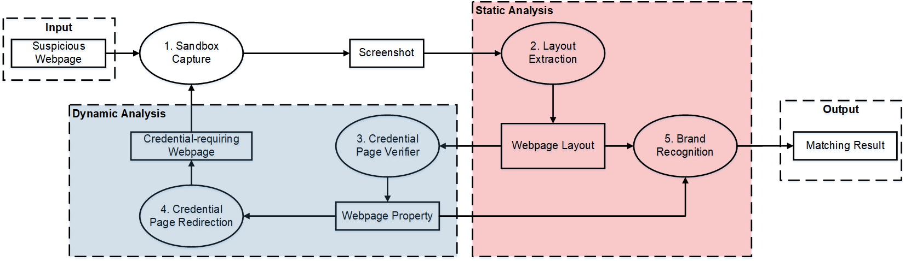

# PhishIntention

- [PhishIntention]
    - This is the repository for phishintention project
    
- [Framework]
    
    
    
    ```Input```: a screenshot, ```Output```: Phish/Benign, Phishing target
    - Step 1: Enter <b>Layout detector</b>, get predicted elements
    - Step 2: Enter <b>Siamese</b>, siamese match a phishing target, get phishing target
        - If Siamese report no target, ```Return``` Benign, None
        - Else Siamese report a target, Enter <b>CRP classifier(and HTML heuristic)</b>

    - Step 3: 

       - If <b>CRP classifier(and heuristic)</b> report it is non-CRP, go to <b>Dynamic analysis</b>, go back to step1
       - Else <b>CRP classifier(and heuristic)</b> reports its a CRP page

    - Step 4: 
        - If reach a CRP + Siamese report target: ```Return``` Phish, Phishing target
        - Else: ```Return``` Benign

- [Instructions]
    - Please run phishintention_main.py to get prediction
    ```
      python phishintention_main.py --folder [data folder] --results [xxx.txt]
        ```

- [Project structure]
    - src
        - credential_classifier: training scrip for CRP classifier
        - layout_matcher: script for layout matcher and layout heuristic
        - phishpedia: training script for siamese
        - element_detector: training script for element detector

        - element_detector.py: main script for element detector
        - credential.py: main script for CRP classifier
        - layout.py: main script for layout 
        - siamese.py: main script for siamese

        